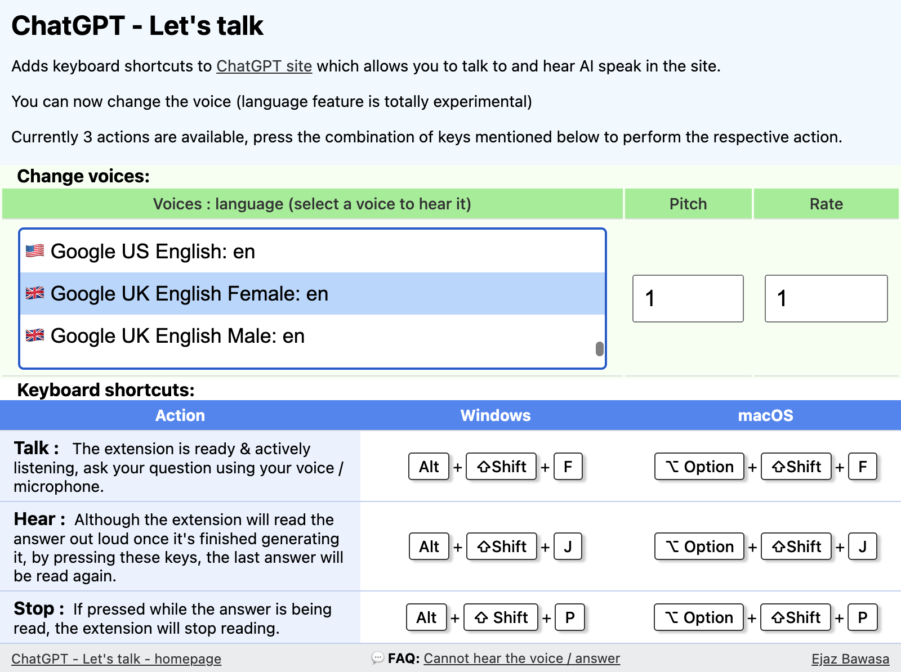

# ChatGPT - Let's talk

A chrome extension that adds the ability to voice chat with ChatGPT using a few keyboard shortcuts.

&nbsp;
&nbsp;

Available on the web store at: https://chrome.google.com/webstore/detail/chatgpt-lets-talk/ldkeljfcpadfpkfdloofmhamhkgdcpbo?hl=en&authuser=0

&nbsp;
&nbsp;

## Ask questions using your microphone
To voice chat and ask ChatGPT questions using your microphone, press the following combination of keys simultaneously:

### **Windows**: `Alt + Shift + F`

### **Mac**: `Option + Shift + F`

Once the keys are pressed the extension will be actively listening, so just ask questions using your voice. The extension will listen and submit your question. The answer will be read out loud automatically after being generated.

&nbsp;
&nbsp;

## Hear ChatGPT repeat the last answer
Although the extension will read the answer out loud once it's finished generating it, you can also make it repeat its last answer. To do so, press the following combination of keys simultaneously:

### **Windows**: `Alt + Shift + J`

### **Mac**: `Option + Shift + J`

ChatGPT's last answer will be read out loud.

&nbsp;
&nbsp;

## Stop the voice while it's reading the answer.
To stop the voice while it's reading the answer out loud, press the following combination of keys simultaneously:

### **Windows**: `Alt + Shift + P`

### **Mac**: `Option + Shift + P`

If pressed while the answer is being read out loud, the reading will stop.

&nbsp;
&nbsp;

## Features
- ## You can now change the voice for the AI, pitch of the voice and the rate at which the words are spoken.
- ### Uses in-built browser APIs to hear the questions and read the answer out loud. `SpeechRecognition` and `SpeechSynthesisUtterance` APIs namely.
- ### Written in native Javascript, does not use any external libraries or APIs other than the ones already available in the browser.
- ### Almost no UI, just press the keyboard shortcuts and you are ready to go.

&nbsp;
&nbsp;

## Installation
Chrome web store approved, the extension can be downloaded from: https://chrome.google.com/webstore/detail/chatgpt-lets-talk/ldkeljfcpadfpkfdloofmhamhkgdcpbo?hl=en&authuser=0

To manually install the extension from here follow these steps:

1. Clone the repo or download the zip and unzip the files.

2. Go to the "Chrome extensions" tab

3. Enable "developer mode"

4. Click on "Load unpacked" and select the folder. Enjoy!

## Troubleshooting
### Cannot hear the answer
Sometimes, due to site sound permission, you might not hear the voice automatically at the end of the answer generation. In order to fix this, you need to tell Chrome to allow sound from the ChatGPT site. Follow this process to enable it:

1. Go to the "Site Information" settings by pressing the lock icon next to the website URL

2. Click on "Site settings"

3. Go to the "Sound" setting and change it from "Automatic (default)"

4. to "Allow"

### Microphone access

The first time pressing the keyboard shortcut `Alt + Shift + F` on Windows and `Option + Shift + F` on OSX, Chrome will show a pop-up asking for microphone access. Click "Allow" to use it.

## Roadmap

- ~~Ability to select/change voice.~~
- Improve sound permission, sometimes sound permission prevents the voice from being heard.
- Improve error handling and figure out edge cases.

## Feedback
Please create issues with any feedback. Thanks!

## Author
[Ejaz Bawasa](https://zaje.me/) <> [LinkedIn](https://www.linkedin.com/in/ejazbawasa/)
